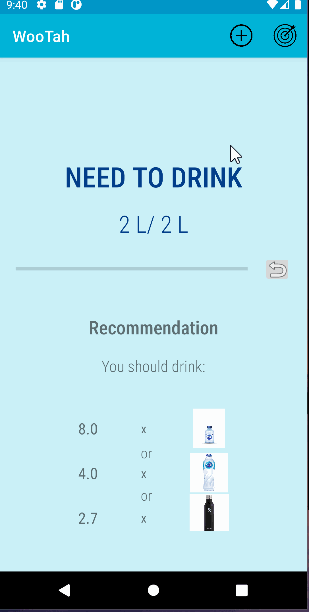

# Project WooTah

##HooHacks2022 
Team: TraDa2k1VjpPro
Members: Dat Le, Lauren Nguyen

**WooTah** is a mobile application that allows users to track their daily water drinking habit.

## User Stories

The following **required** functionality is completed:

- [x] User can add their water intake using either the given suggestions or typing in their own amount
- [x] User can set daily water drinking goal
- [x] User can exit the app without losing data
- [x] User can reset the amount of water consumed daily
- [x] User can see recommendations on how much more water they should drink to meet their goal

**Future** enhancements:

- Data visualization of user's monthly water drinking pattern
- Alarms to remind users to drink water throughout the day
- Allow users to share their achievements with friends and families through social media platforms
- Allow users to take a picture of their daily tumbler/water container to generate a better, more accurate estimate of their regular amount of water intake

## Video Walkthrough

Here's a walkthrough of implemented user stories:

GIF created with [LiceCap](http://www.cockos.com/licecap/).

## Notes

While building WooTah, we ran into a variety of technical problems that involve debugging and testing (NullPointerException, anticipating and parsing user input, etc.).

## License

    Copyright [2022] [Dat Le, Trang Nguyen]

    Licensed under the Apache License, Version 2.0 (the "License");
    you may not use this file except in compliance with the License.
    You may obtain a copy of the License at

        http://www.apache.org/licenses/LICENSE-2.0

    Unless required by applicable law or agreed to in writing, software
    distributed under the License is distributed on an "AS IS" BASIS,
    WITHOUT WARRANTIES OR CONDITIONS OF ANY KIND, either express or implied.
    See the License for the specific language governing permissions and
    limitations under the License.
